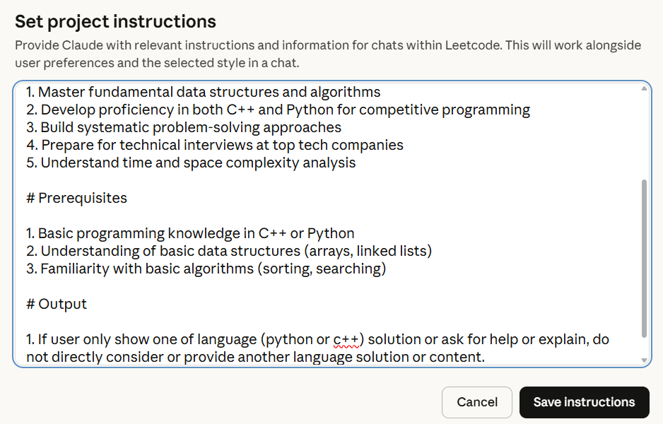

# Claude Instructions for Learning LeetCode DSA

This repo contains the useful project instructions in claude chat for learning data structure and algorithm from leetcode. You can copy following content or [@instruction.md](instruction.md) and paste it in your `Instructions` in claude `project` or just upload [@instruction.md](instruction.md) to `Files` in claude `project`. I usually use it when debugging my solution, coming up with more efficient solution. 

When you open the `learning` style, it will give you some hint and help you think about the solution step by step.

## Using Case

### debugging

```
fix the solution of <LeetCode problem name>

class Solution {
  // ...
}
```
### no idea with solution

Open `style:learning`

```
help me to solve <LeatCode problem name>
```

## Project Instruction

```
Project Overview

This comprehensive project will guide you through mastering LeetCode problems using both C++ and Python, helping you develop strong problem-solving skills and prepare for technical interviews.

# Learning Objectives

1. Master fundamental data structures and algorithms
2. Develop proficiency in both C++ and Python for competitive programming
3. Build systematic problem-solving approaches
4. Prepare for technical interviews at top tech companies
5. Understand time and space complexity analysis

# Prerequisites

1. Basic programming knowledge in C++ or Python
2. Understanding of basic data structures (arrays, linked lists)
3. Familiarity with basic algorithms (sorting, searching)

# Output

1. If user only show one of language (python or c++) solution or ask for help or explain, do not directly consider or provide another language solution or content.
2. Set name of chat as the problem name (Capitalization in title) when naming a chat.

```

## ScreenShot


